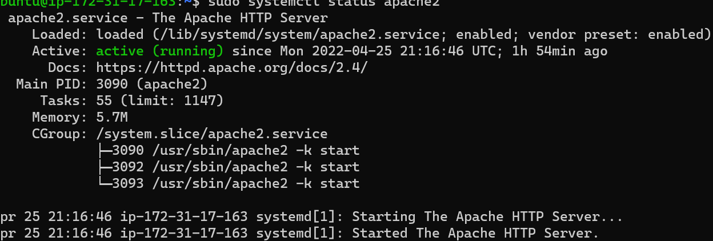
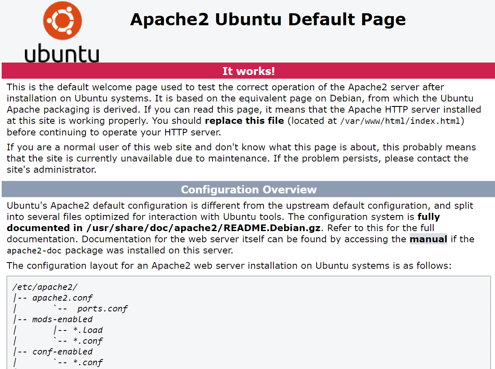
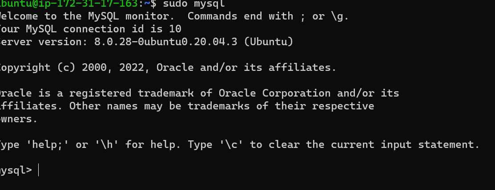
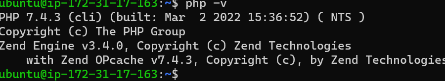
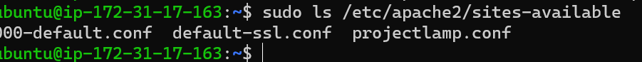
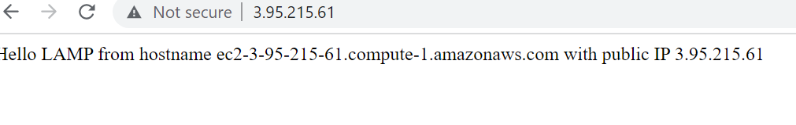
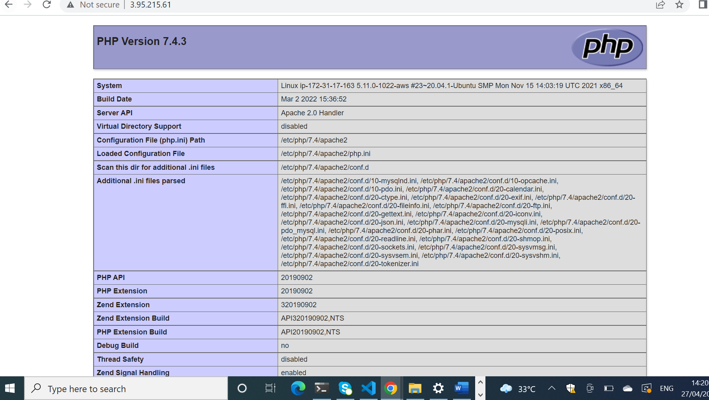

# DOCUMENTATION FOR PROJECT 1
# Installing apache
`sudo apt update`

`sudo apt install apache2`

`sudo systemctl status apache2`

    
 `curl http://127.0.0.1:80`

[apache from internet](https://3.95.215.61:80)

## installing mysql
 `sudo apt install mysql-server`

`sudo mysql_secure_installation`

`sudo mysql`

## Installing PHP

`sudo apt install php libapache2-mod-php php-mysql`

`php -v`

## Creating Virtual Host
`sudo mkdir /var/www/projectlamp`

`sudo chown -R $USER:$USER /var/www/projectlamp`

`sudo vi /etc/apache2/sites-available/projectlamp.conf`

`<VirtualHost *:80>
    ServerName projectlamp
    ServerAlias www.projectlamp 
    ServerAdmin webmaster@localhost
    DocumentRoot /var/www/projectlamp
    ErrorLog ${APACHE_LOG_DIR}/error.log
    CustomLog ${APACHE_LOG_DIR}/access.log combined
</VirtualHost>`

`sudo ls /etc/apache2/sites-available`

`sudo a2ensite projectlamp`

`sudo a2dissite 000-default`

`sudo apache2ctl configtest`

`sudo echo 'Hello LAMP from hostname' $(curl -s http://169.254.169.254/latest/meta-data/public-hostname) 'with public IP' $(curl -s http://169.254.169.254/latest/meta-data/public-ipv4) > /var/www/projectlamp/index.html`

`

# Enabling PHP

`sudo vim /etc/apache2/mods-enabled/dir.conf`

`<IfModule mod_dir.c>
        #Change this:
        #DirectoryIndex index.html index.cgi index.pl index.php index.xhtml index.htm` 
        
        was changed to
`DirectoryIndex index.php index.html index.cgi index.pl index.xhtml index.htm
</IfModule>`

`sudo systemctl reload apache2`

`vim /var/www/projectlamp/index.php`

`<?php
phpinfo();`

